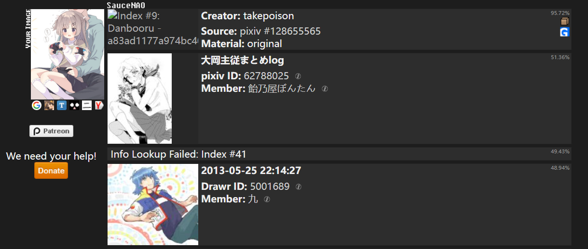

# astrbot_plugin_search_pic

---

## 简介:
astrbot插件，目前仅支持 aiocqhttp 平台  
从 https://saucenao.com/ 搜索图片，功能是以图搜图

作者: lyjlyjlyjly  
版本: v1.0.0

---

## 指令列表：
- 搜图  
    别名 “soutu”
    发出消息后在 30s 内发送图片进行搜图  
    搜索结果仅供参考，有概率出现网站上存在但是搜不到的问题  
    由于QQ有审查机制，R18的图在群里可能发不出来，所以搜R18建议私聊  
    图片不要旋转  
- 搜图来源  
    查询搜索范围
- 搜图帮助  
    获取帮助信息

如果是在群聊消息，需要在前面加上astrbot的唤醒前缀

---

## 搜索范围如下：
1. H-Magazines
2. H-Game CG
3. DoujinshiDB
4. pixiv Images
5. Nico Nico Seiga
6. Danbooru
7. drawr Images
8. Nijie Images
9. Yande.re
10. Shutterstock
11. FAKKU
12. H-Misc (nH)
13. 2D-Market
14. MediBang
15. Anime
16. H-Anime
17. Movies
18. Shows
19. Gelbooru
20. Konachan
21. Sankaku Channel
22. Anime-Pictures.net
23. e621.net
24. Idol Complex
25. bcy.net Illust
26. bcy.net Cosplay
27. PortalGraphics.net
28. deviantArt
29. Pawoo.net
30. Madokami (Manga)
31. MangaDex
32. H-Misc (eH)
33. ArtStation
34. FurAffinity
35. Twitter
36. Furry Network
37. Kemono
38. Skeb

---

## 提醒

这个网站可能会出现有搜索结果但是没有图片的情况，有时候甚至只有相似度没有搜索结果，如下图：

没有图片src，没有搜索结果，输出就没有东西，这不是程序的问题